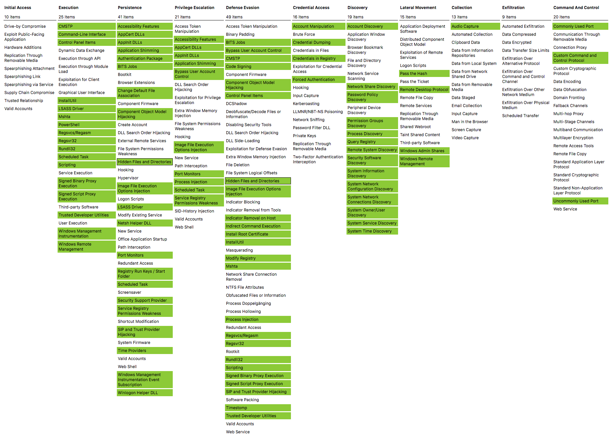

# sysmon-modular | A Sysmon configuration repository for everybody to customise

[](https://github.com/olafhartong/sysmon-modular/blob/master/license.md)

[](https://github.com/olafhartong/sysmon-modular/commit/master)

[](https://twitter.com/olafhartong)

This is a Microsoft Sysinternals Sysmon [download here](https://docs.microsoft.com/en-us/sysinternals/downloads/sysmon) configuration repository, set up modular for easier maintenance and generation of specific configs.

The sysmonconfig.xml within the repo is automatically generated after a successful merge by the PowerShell script and a successful load by Sysmon in an Azure Pipeline run.

## NOTICE; Sysmon below 13 will not completely be compatible with this configuration

Older versions are still available in the branches, but are not as complete as the current branch

- V8.x >> [here](https://github.com/olafhartong/sysmon-modular/tree/version-8)
- V9.x >> [here](https://github.com/olafhartong/sysmon-modular/tree/version-9)
- V10.4 >> [here](https://github.com/olafhartong/sysmon-modular/tree/v10.4)
- V12.x >> [here](https://github.com/olafhartong/sysmon-modular/tree/version-12)

To understand added features in the latest version, have a look at my [small blog post](https://medium.com/falconforce/sysmon-11-dns-improvements-and-filedelete-events-7a74f17ca842) or watch my [DerbyCon talk](http://www.irongeek.com/i.php?page=videos/derbycon9/stable-36-endpoint-detection-super-powers-on-the-cheap-with-sysmon-olaf-hartong)

**Note:**
I do recommend using a minimal number of configurations within your environment for multiple obvious reasons, like; maintenance, output equality, manageability and so on. But do make tailored configurations for Domain Controllers, Servers and workstations.

## Credits

Big credit goes out to SwiftOnSecurity for laying a great foundation and making this repo possible!
**[sysmonconfig-export.xml](https://github.com/SwiftOnSecurity/sysmon-config/blob/master/sysmonconfig-export.xml)**.

Final thanks to **[Mathias Jessen](https://twitter.com/iisresetme)** for his Merge script, without it, this project would not have worked as well.

## Contributing

Pull requests / issue tickets and new additions will be greatly appreciated!

## More information

I started a series of blog posts covering this repo;
- [Endpoint detection Superpowers on the cheap - part1 - MITRE ATT&CK, Sysmon and my modular configuration](https://medium.com/@olafhartong/endpoint-detection-superpowers-on-the-cheap-part-1-e9c28201ac47)
- [Endpoint detection Superpowers on the cheap — part 2 — Deploy and Maintain](https://medium.com/@olafhartong/endpoint-detection-superpowers-on-the-cheap-part-2-deploy-and-maintain-d06580329fe8)
- [Endpoint detection Superpowers on the cheap — part 3 — Sysmon Tampering](https://medium.com/@olafhartong/endpoint-detection-superpowers-on-the-cheap-part-3-sysmon-tampering-49c2dc9bf6d9)

## Mitre ATT&CK

I strive to map all configurations to the ATT&CK framework whenever Sysmon is able to detect it.
A current ATT&CK navigator export of all linked configurations is found [here](attack_matrix/Sysmon-modular.json) and can be viewed [here](https://mitre.github.io/attack-navigator/enterprise/#layerURL=https%3A%2F%2Fraw.githubusercontent.com%2Folafhartong%2Fsysmon-modular%2Fmaster%2Fattack_matrix%2FSysmon-modular.json&scoring=false&clear_annotations=false)


## Required actions

I highly recommend looking at the configs before implementing them in your production environment. This enables you to have as actionable logging as possible and as litte noise as possible.

### Customization

You will need to install and observe the results of the configuration in your own environment before deploying it widely.
For example, you will need to exclude actions of your antivirus, which will otherwise likely fill up your logs with useless information.

### Generating a config

#### PowerShell

    $> git clone https://github.com/olafhartong/sysmon-modular.git
    $> cd sysmon modular
    $> . .\Merge-SysmonXml.ps1
    $> Merge-AllSysmonXml -Path ( Get-ChildItem '[0-9]*\*.xml') -AsString | Out-File sysmonconfig.xml

### Generating custom configs

Below functions with great thanks to mbmy

**New Function:** 
`Find-RulesInBasePath` - takes a base path (i.e. C:\folder\sysmon-modular\) and finds all candidate xml rule files based upon regex pattern

Example:
```PS C:\Users\sysmon\sysmon-modular> Find-RulesInBasePath -BasePath C:\users\sysmon\sysmon-modular\ -OutputRules | Out-File available_rules.txt```

**Merge-AllSysmonXml New Parameters:**

`-BasePath` - finds all candidate xml rule files from a provided path based upon regex pattern and merges them

Example:
```PS C:\Users\sysmon\sysmon-modular> Merge-AllSysmonXml -AsString -BasePath C:\Users\sysmon\sysmon-modular\```


`-ExcludeList` - Combined with -BasePath, takes a list of rules and excludes them from found rules prior to merge

Example:
```PS C:\Users\sysmon\sysmon-modular> Merge-AllSysmonXml -AsString -BasePath C:\Users\sysmon\sysmon-modular\ -ExcludeList C:\users\sysmon\sysmon-modular\exclude_rules.txt```


`-IncludeList` - Combined with -BasePath, finds all available rules from base path but only merges those defined in a list

Example:
```PS C:\Users\sysmon\sysmon-modular> Merge-AllSysmonXml -AsString -BasePath C:\Users\sysmon\sysmon-modular\ -IncludeList C:\users\sysmon\sysmon-modular\include_rules.txt```


Include/Exclude List Format Example:

```1_process_creation\exclude_adobe_acrobat.xml
3_network_connection_initiated\include_native_windows_tools.xml
12_13_14_registry_event\exclude_internet_explorer_settings.xml
12_13_14_registry_event\exclude_webroot.xml
17_18_pipe_event\include_winreg.xml
19_20_21_wmi_event\include_wmi_create.xml
2_file_create_time\exclude_chrome.xml
3_network_connection_initiated\include_native_windows_tools.xml
3_network_connection_initiated\include_ports_proxies.xml
8_create_remote_thread\include_general_commment.xml
8_create_remote_thread\include_psinject.xml
9_raw_access_read\include_general_commment.xml
```


## Use

### Install

Run with administrator rights

    sysmon.exe -accepteula -i sysmonconfig.xml

### Update existing configuration

Run with administrator rights

    sysmon.exe -c sysmonconfig.xml
