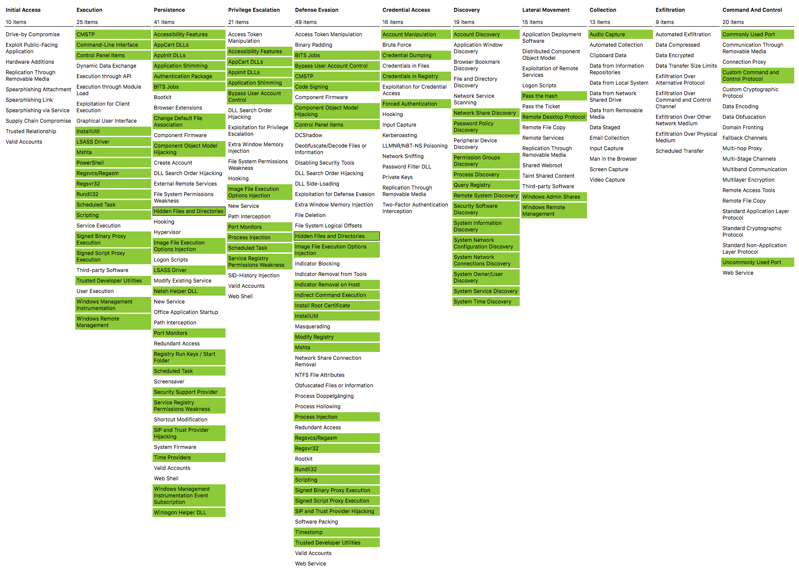

# sysmon-modular

A modular Microsoft Sysmon configuration repository for customizable endpoint detection.

[](license.md)


## Overview

This repository breaks the monolithic Sysmon XML configuration into modular, maintainable pieces organized by event type. Each module contains include and exclude rules that can be customized per environment and merged into a single deployment-ready config.

The pre-built `sysmonconfig.xml` is automatically generated after a successful CI/CD run.

**Requires Sysmon v11+.** Older versions are available in branches: [v8](https://github.com/olafhartong/sysmon-modular/tree/version-8) | [v9](https://github.com/olafhartong/sysmon-modular/tree/version-9) | [v10.4](https://github.com/olafhartong/sysmon-modular/tree/v10.4)

## Repository Structure

```
sysmon-modular/
├── sysmonconfig.xml              # Pre-built merged config (ready to deploy)
├── Merge-SysmonXml.ps1           # PowerShell merge script
├── SysmonConfigManager.ps1       # Interactive config management tool
├── samples/                      # Sample Sysmon events for testing
├── attack_matrix/                # MITRE ATT&CK Navigator mapping
│
├── 1_process_creation/           # Event ID 1  - Process Create
├── 2_file_create_time/           # Event ID 2  - File Creation Time Changed
├── 3_network_connection_initiated/ # Event ID 3  - Network Connection
├── 5_process_ended/              # Event ID 5  - Process Terminated
├── 6_driver_loaded_into_kernel/  # Event ID 6  - Driver Loaded
├── 7_image_load/                 # Event ID 7  - Image Loaded
├── 8_create_remote_thread/       # Event ID 8  - CreateRemoteThread
├── 9_raw_access_read/            # Event ID 9  - RawAccessRead
├── 10_process_access/            # Event ID 10 - Process Access
├── 11_file_create/               # Event ID 11 - File Create
├── 12_13_14_registry_event/      # Event ID 12/13/14 - Registry Events
├── 15_file_create_stream_hash/   # Event ID 15 - FileCreateStreamHash
├── 17_18_pipe_event/             # Event ID 17/18 - Pipe Events
├── 19_20_21_wmi_event/           # Event ID 19/20/21 - WMI Events
├── 22_dns_query/                 # Event ID 22 - DNS Query
└── 23_file_delete/               # Event ID 23 - File Delete
```

Each event directory contains:
- **`include_*.xml`** - Rules to detect suspicious/malicious behavior
- **`exclude_*.xml`** - Rules to filter benign noise (AV products, Windows services, etc.)

## Quick Start

### Use the pre-built config

Download `sysmonconfig.xml` and deploy directly:

```cmd
:: Install Sysmon with this config (run as Administrator)
sysmon.exe -accepteula -i sysmonconfig.xml

:: Update an existing Sysmon installation
sysmon.exe -c sysmonconfig.xml
```

### Generate a custom config

Clone the repo, remove or add modules to suit your environment, then merge:

```powershell
git clone https://github.com/olafhartong/sysmon-modular.git
cd sysmon-modular
. .\Merge-SysmonXml.ps1
Merge-AllSysmonXml -Path (Get-ChildItem '[0-9]*\*.xml') -AsString | Out-File sysmonconfig.xml
```

### Tune your config interactively

Use the [SysmonConfigManager](CONFIGMANAGER.md) to analyze events and generate rules without hand-editing XML:

```powershell
. .\SysmonConfigManager.ps1
Start-SysmonConfigManager
```

## Customization

Review the configs before deploying to production. You will likely need to:

1. **Exclude your security tools** - AV, EDR, and monitoring agents generate significant noise
2. **Exclude IT management software** - SCCM, Intune, deployment tools
3. **Add environment-specific includes** - LOLbin usage patterns unique to your org
4. **Remove unnecessary modules** - If you don't need DNS query logging, remove the `22_dns_query/` directory before merging

Each XML module is self-contained and follows this structure:

```xml
<Sysmon schemaversion="4.30">
  <EventFiltering>
    <RuleGroup name="rule_name" groupRelation="or">
      <ProcessCreate onmatch="exclude">
        <Rule groupRelation="and">
          <Image condition="end with">example.exe</Image>
          <CommandLine condition="contains">expected_argument</CommandLine>
        </Rule>
      </ProcessCreate>
    </RuleGroup>
  </EventFiltering>
</Sysmon>
```

## MITRE ATT&CK Coverage

Configurations are tagged with MITRE ATT&CK technique IDs. View the current coverage:

- [ATT&CK Navigator JSON](attack_matrix/Sysmon-modular.json) - import into the [ATT&CK Navigator](https://mitre-attack.github.io/attack-navigator/)
- Coverage heatmap:



## Credits

- **[SwiftOnSecurity](https://github.com/SwiftOnSecurity/sysmon-config)** - Foundation sysmon config that made this project possible
- **[Roberto Rodriguez](https://github.com/Cyb3rWard0g/ThreatHunter-Playbook)** - ThreatHunter-Playbook and community contributions
- **[Mathias Jessen](https://twitter.com/iisresetme)** - PowerShell merge script

## Further Reading

- [Endpoint detection Superpowers on the cheap - Part 1: MITRE ATT&CK, Sysmon and modular configuration](https://medium.com/@olafhartong/endpoint-detection-superpowers-on-the-cheap-part-1-e9c28201ac47)
- [Part 2: Deploy and Maintain](https://medium.com/@olafhartong/endpoint-detection-superpowers-on-the-cheap-part-2-deploy-and-maintain-d06580329fe8)
- [Part 3: Sysmon Tampering](https://medium.com/@olafhartong/endpoint-detection-superpowers-on-the-cheap-part-3-sysmon-tampering-49c2dc9bf6d9)
- [Sysmon 11 - DNS improvements and FileDelete events](https://medium.com/falconforce/sysmon-11-dns-improvements-and-filedelete-events-7a74f17ca842)

## Contributing

See [CONTRIBUTING.md](CONTRIBUTING.md) for guidelines on adding new detection rules and exclusions.

## License

[MIT](license.md)
